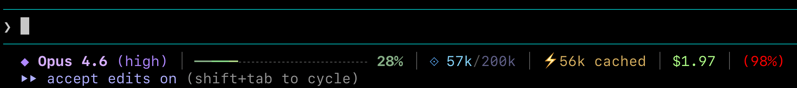

# Claude Code Status Line

A Go binary that renders the Claude Code status line. Reads JSON from stdin, writes ANSI-colored output to stdout. No external dependencies -- stdlib only.

Replaces the original shell script (`statusline.sh`) which spawned 8+ subprocesses (jq, awk, sed) per invocation.

## Layout




```
 Model (effort) | ━━━━━━━╌╌╌╌╌╌╌╌╌╌╌╌╌ 35% | tokens/window | cache | $cost | (rate limit %)
```

| Section | Description | Colors (256-color) |
|---|---|---|
| Model badge | Diamond + model name sans "Claude " prefix | Purple diamond (141), bold light purple name (183) |
| Effort level | Current effort in parentheses; omitted if absent | Purple (141) |
| Progress bar | 20-segment context window usage with 4 gradient tiers | Green-to-red gradient; dark gray (238) unfilled |
| Percentage | Context window usage percent, color-matched to tier | Green (108) / yellow (222) / orange (209) / red (196) |
| Token counter | Used tokens / window size with auto-scaling (k/M) | Blue diamond (75), light blue (117), dark blue-gray (60) |
| Cache | Cache read tokens; omitted if zero | Yellow bolt (220), tan text (179) |
| Session cost | Estimated USD cost | Light green (156) |
| Rate limit | 5-hour session limit usage; omitted if absent | Green (108) / yellow (222) / red (196) |

Sections are separated by gray (240) pipe characters.

## Installation

```sh
cd statusline
go build -trimpath -ldflags="-s -w" -o ~/.claude/statusline .
```

- `-ldflags="-s -w"` -- strips the symbol table (`-s`) and DWARF debug info (`-w`)
- `-trimpath` -- removes local filesystem paths (username, directory structure) from the binary

Then in `~/.claude/settings.json`:

```json
{
  "statusLine": {
    "type": "command",
    "command": "~/.claude/statusline"
  }
}
```

## JSON Input

The binary reads the Claude Code status line JSON from stdin. Fields consumed:

- `model.display_name`
- `context_window.used_percentage`
- `context_window.context_window_size`
- `context_window.current_usage.{cache_read_input_tokens,cache_creation_input_tokens,input_tokens,output_tokens}`
- `effort.level`
- `cost.total_cost_usd`
- `rate_limits.five_hour.used_percentage`

## Benchmark vs Shell Script

Tested 2026-04-25 on macOS Darwin 25.4.0, Apple Silicon, Go 1.26.2.

Benchmarked with [hyperfine](https://github.com/sharkdp/hyperfine): 10 warmup runs, 200 minimum runs per benchmark, identical JSON piped to both via stdin.

| Implementation | Mean | Std Dev | Range |
|---|---|---|---|
| Go binary | 2.2 ms | 0.2 ms | 1.9 - 2.9 ms |
| Shell script | 36.3 ms | 0.7 ms | 34.9 - 38.8 ms |

**Go is 16.6x faster.** The shell version pays fork/exec overhead for every jq, awk, and sed call. The Go binary parses JSON once and formats everything in-process.

```sh
hyperfine --warmup 10 --min-runs 200 \
  "echo '$SAMPLE' | ~/.claude/statusline" \
  "echo '$SAMPLE' | ~/.claude/statusline.sh"
```
