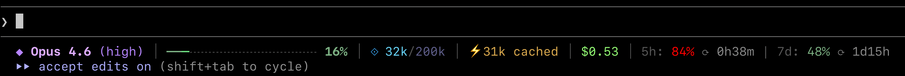

# Claude Code Status Line


A Go binary that renders the Claude Code status line. Reads JSON from stdin, writes ANSI-colored output to stdout. No external dependencies -- stdlib only.

Replaces the original shell script (`statusline.sh`) which spawned 8+ subprocesses (jq, awk, sed) per invocation.

### AI Disclaimer

This program was entirely vibe coded with **Claude Opus 4.6**.
As such, the author can't be held responsible for incorrect output.

## Layout



```
 Model (effort) | ━━━━━━━╌╌╌╌╌╌╌╌╌╌╌╌╌ 35% | tokens/window | cache | $cost | (5h%) | (7d%) | ⟳ 3d4h
```

| Section | Description | Colors (256-color) |
|---|---|---|
| Model badge | Diamond + model name sans "Claude " prefix | Purple diamond (141), bold light purple name (183) |
| Effort level | Current effort in parentheses; omitted if absent | Purple (141) |
| Progress bar | 20-segment context window usage with 4 gradient tiers | Green-to-red gradient; dark gray (238) unfilled |
| Percentage | Context window usage percent, color-matched to tier | Green (108) / yellow (222) / orange (209) / red (196) |
| Token counter | Used tokens / window size with auto-scaling (k/M) | Blue diamond (75), light blue (117), dark blue-gray (60) |
| Cache | Cache read tokens; omitted if zero | Yellow bolt (220), tan text (179) |
| Session cost | Estimated USD cost | Light green (156) |
| Rate limit (5h) | 5-hour session limit usage; omitted if absent | Green (108) / yellow (222) / red (196) |
| Rate limit (7d) | 7-day weekly limit usage; omitted if absent | Green (108) / yellow (222) / red (196) |
| Reset countdown | Time until 7-day limit resets; omitted if absent | Gray (245), "now" if past |

Sections are separated by gray (240) pipe characters.

## Installation

```sh
GOBIN=~/.claude go install -trimpath -ldflags="-s -w" github.com/jftuga/claude-statusline@latest
```

Or manually:

```sh
make install
```

- `-trimpath` -- removes local filesystem paths (username, directory structure) from the binary
- `-ldflags="-s -w"` -- strips the symbol table (`-s`) and DWARF debug info (`-w`)

Check the installed version with `~/.claude/claude-statusline -v`.

Then in `~/.claude/settings.json`:

```json
{
  "statusLine": {
    "type": "command",
    "command": "~/.claude/claude-statusline"
  }
}
```

## JSON Input

The binary reads the Claude Code status line JSON from stdin. Fields consumed:

- `model.display_name`
- `context_window.used_percentage`
- `context_window.context_window_size`
- `context_window.current_usage.{cache_read_input_tokens,cache_creation_input_tokens,input_tokens,output_tokens}`
- `effort.level`
- `cost.total_cost_usd`
- `rate_limits.five_hour.used_percentage`
- `rate_limits.seven_day.used_percentage`
- `rate_limits.seven_day.resets_at` (unix epoch)

## Benchmark vs Shell Script

Tested 2026-04-25 on macOS Darwin 25.4.0, Apple Silicon, Go 1.26.2.

Benchmarked with [hyperfine](https://github.com/sharkdp/hyperfine): 10 warmup runs, 200 minimum runs per benchmark, identical JSON piped to both via stdin.

| Implementation | Mean | Std Dev | Range |
|---|---|---|---|
| Go binary | 1.8 ms | 0.2 ms | 1.5 - 2.9 ms |
| Shell script | 47.5 ms | 0.8 ms | 46.0 - 51.0 ms |

**Go is 26.9x faster.** The shell version pays fork/exec overhead for every jq, awk, and sed call. The Go binary parses JSON once and formats everything in-process.

```sh
hyperfine --warmup 10 --min-runs 200 \
  "echo '$SAMPLE' | ~/.claude/claude-statusline" \
  "echo '$SAMPLE' | ~/.claude/statusline.sh"
```

## References

- [Claude Code status line documentation](https://code.claude.com/docs/en/statusline) -- official docs for configuring the `statusLine` setting in `settings.json` and the JSON payload schema
- [full_json_schema.json](full_json_schema.json) -- complete JSON payload sent by Claude Code to the status line command via stdin, captured and used as the reference for all available fields
- [ANSI 256-color chart](https://en.wikipedia.org/wiki/ANSI_escape_code#8-bit) -- color index reference for the `\033[38;5;Nm` escape sequences used throughout


## Personal Project Disclosure

This program is my own original idea, conceived and developed entirely:

* On my own personal time, outside of work hours
* For my own personal benefit and use
* On my personally owned equipment
* Without using any employer resources, proprietary information, or trade secrets
* Without any connection to my employer's business, products, or services
* Independent of any duties or responsibilities of my employment

This project does not relate to my employer's actual or demonstrably
anticipated research, development, or business activities. No
confidential or proprietary information from any employer was used
in its creation.
